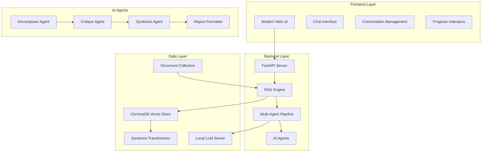
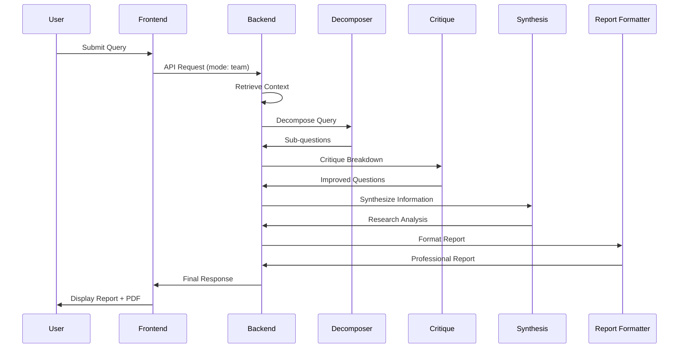

# AI Research Assistant

A sophisticated, offline-capable AI research system that combines Retrieval-Augmented Generation (RAG) with a multi-agent pipeline to provide comprehensive research reports from local document collections.

## 🚀 Features

- **🔍 Intelligent Document Search**: Semantic search across your document collection
- **🤖 Multi-Agent Pipeline**: Specialized AI agents working collaboratively
- **📄 Professional Report Generation**: Academic-quality research reports
- **🔒 Complete Privacy**: All processing happens locally, no data leaves your system
- **📱 Modern Web Interface**: Responsive design with conversation management
- **⚡ Dual Modes**: Quick search and comprehensive multi-agent analysis
- **📁 File Management**: Upload, browse, and manage research documents
- **🔄 Knowledge Base Rebuilding**: Rebuild search indexes when documents change
- **🎨 Corporate UI**: Professional interface with light/dark mode support

## 🏗️ Architecture Overview



## 🛠️ Technical Stack

### Backend
- **FastAPI**: High-performance Python web framework
- **LlamaIndex**: Document processing and vector operations
- **ChromaDB**: Vector database for semantic search
- **Sentence Transformers**: `all-MiniLM-L6-v2` for embeddings
- **Ollama**: Local LLM inference server
- **PyYAML**: YAML configuration management

### Frontend
- **Vanilla JavaScript**: Modern ES6+ features
- **CSS Custom Properties**: Design system with CSS variables
- **Responsive Design**: Mobile-first approach
- **Markdown Rendering**: Client-side markdown processing
- **PDF Export**: Browser-based PDF generation

### AI/ML
- **Multi-Agent Architecture**: Specialized agents for different tasks
- **RAG Pipeline**: Retrieval-Augmented Generation
- **Prompt Engineering**: Structured prompts for consistent outputs
- **Local LLM**: Privacy-focused AI processing
- **YAML Configuration**: Dynamic agent and pipeline configuration

## 📁 File Management System

The AI Research Assistant includes a comprehensive file management system that allows you to:

### **Document Operations**
- **File Upload**: Drag & drop or browse to upload PDF, TXT, DOC, DOCX, and MD files
- **File Browsing**: View all documents in your knowledge base with metadata
- **File Deletion**: Remove documents you no longer need
- **File Statistics**: Monitor total file count and storage usage

### **Knowledge Base Management**
- **Index Rebuilding**: Rebuild search indexes when documents are added/removed
- **Progress Tracking**: Real-time progress indicators for rebuild operations
- **File Validation**: Automatic file type and format validation
- **Error Handling**: Graceful error handling with user-friendly notifications

### **Supported File Types**
- **PDF Documents**: Research papers, reports, and academic documents
- **Text Files**: Plain text documents and notes
- **Word Documents**: Microsoft Word (.doc, .docx) files
- **Markdown**: Structured text documents with formatting

## ⚙️ Configuration System

The AI Research Assistant uses a comprehensive YAML-based configuration system that allows you to:

### **Configure Agents**
- **System Prompts**: Define how each agent behaves and responds
- **LLM Parameters**: Set temperature, max tokens, and other generation settings
- **Agent Roles**: Specify the purpose and responsibilities of each agent
- **Custom Behaviors**: Tailor agent responses for specific use cases

### **Manage Pipeline**
- **Step Configuration**: Define the sequence and dependencies of pipeline steps
- **Timing Estimates**: Set expected processing times for each step
- **Error Handling**: Configure how the pipeline responds to failures
- **Parallel Processing**: Enable/disable concurrent agent execution

### **Model Management**
- **Multiple Models**: Support for various Ollama models
- **Model Parameters**: Configure context lengths and default settings
- **Provider Settings**: Set up different LLM providers
- **Fallback Options**: Define backup models for reliability

### **Output Customization**
- **Report Templates**: Academic, business, and technical report styles
- **PDF Settings**: Page size, fonts, margins, and formatting
- **Export Formats**: Markdown, HTML, and PDF output options
- **Custom Styling**: Professional formatting and branding

### **Configuration Files**
```
config/
├── agents.yaml              # Main configuration file
├── agents/                  # Agent-specific configs (optional)
│   ├── decomposer.yaml
│   ├── critique.yaml
│   └── synthesis.yaml
└── templates/               # Report templates (optional)
    ├── academic.yaml
    ├── business.yaml
    └── technical.yaml
```

### **Configuration Management**
```bash
# Validate configuration
python scripts/manage_config.py validate

# Show configuration summary
python scripts/manage_config.py summary

# Reload configuration (without restart)
python scripts/manage_config.py reload

# Create sample configuration
python scripts/manage_config.py sample
```

### **Complete Configuration Example**

The system uses a comprehensive YAML configuration file located at `config/agents.yaml`. Here's the complete configuration structure:

```yaml
# Global Configuration
global:
  default_model: "gemma3:4b"
  max_context_length: 8192
  temperature: 0.7
  max_tokens: 2048
  timeout_seconds: 15

# Agent Definitions
agents:
  decomposer:
    name: "Decomposer Agent"
    role: "Research Question Analyzer"
    description: "Breaks down complex research questions into structured sub-questions"
    system_prompt: |
      You are a research question analyzer. Break down complex research questions into clear, actionable sub-questions.
      
      Output format:
      ## Research Breakdown
      ### Main Topic: [Research focus]
      ### Sub-Questions: [3-4 specific questions]
      ### Research Steps: [3-4 logical steps]
      ### Expected Outcomes: [What the research should achieve]
    parameters:
      temperature: 0.6
      max_tokens: 512
      top_p: 0.9
      timeout: 120

  critique:
    name: "Critique Agent"
    role: "Research Framework Reviewer"
    description: "Reviews and improves the decomposed research framework"
    system_prompt: |
      You are a research framework reviewer. Critically evaluate and improve research breakdowns.
      
      Output format:
      ## Critique and Improvements
      ### Strengths: [What's working well]
      ### Areas for Improvement: [Specific issues and gaps]
      ### Enhanced Framework: [Improved version]
      ### Quality Assessment: [Overall assessment]
    parameters:
      temperature: 0.7
      max_tokens: 800
      timeout: 120

# Pipeline Configuration
pipeline:
  name: "Multi-Agent Research Pipeline"
  description: "Sequential processing pipeline for comprehensive research analysis"
  steps:
    - name: "Query Decomposition"
      agent: "decomposer"
      description: "Break down research question into components"
      estimated_time: 2
      required: true
      
    - name: "Framework Critique"
      agent: "critique"
      description: "Review and improve research framework"
      estimated_time: 2
      required: true
      depends_on: ["decomposer"]

# Model Configuration
models:
  gemma3:4b:
    name: "Gemma 3 4B (Default)"
    provider: "ollama"
    base_url: "http://localhost:11434"
    context_length: 8192
    default_parameters:
      temperature: 0.7
      top_p: 0.9
      max_tokens: 2048
    priority: 1

# Output Configuration
output:
  formats: ["markdown", "pdf", "html"]
  report_templates:
    academic:
      name: "Academic Research Report"
      style: "formal"
      sections: ["abstract", "introduction", "methodology", "results", "discussion", "conclusion", "references"]
    business:
      name: "Business Analysis Report"
      style: "professional"
      sections: ["executive_summary", "background", "analysis", "findings", "recommendations", "appendix"]
  default_template: "academic"
```

### **Key Configuration Features**

#### **Agent Configuration**
- **System Prompts**: Detailed instructions for each agent's behavior
- **Parameters**: Fine-tuned settings for temperature, tokens, and timeouts
- **Roles & Descriptions**: Clear definition of each agent's purpose
- **Output Formats**: Structured output templates for consistency

#### **Pipeline Management**
- **Sequential Processing**: Ordered execution with dependencies
- **Error Handling**: Configurable error recovery strategies
- **Progress Tracking**: Real-time pipeline status monitoring
- **Intermediate Outputs**: Access to results from each pipeline step

#### **Model Support**
- **Multiple Models**: Support for Gemma, Llama, Mistral, and other Ollama models
- **Model Parameters**: Customizable generation parameters per model
- **Fallback Support**: Automatic fallback to backup models
- **Provider Configuration**: Flexible LLM provider integration

#### **Report Customization**
- **Multiple Templates**: Academic, business, and technical report styles
- **Output Formats**: Markdown, PDF, and HTML export options
- **Styling Options**: Customizable fonts, margins, and page layouts
- **Section Configuration**: Flexible report structure definition

## �� Project Structure

```
ai-research-assistant/
├── app/                          # Backend application
│   ├── main.py                  # FastAPI server entry point
│   ├── rag.py                   # RAG engine and pipeline
│   ├── ollama_client.py         # LLM client interface
│   ├── pipeline_config.py       # Multi-agent pipeline configuration
│   └── agents/                  # AI agent implementations
│       ├── decomposer.py        # Query decomposition agent
│       ├── critique.py          # Analysis critique agent
│       ├── synthesis.py         # Information synthesis agent
│       └── report_formatter.py  # Professional report formatting
├── frontend/                     # Frontend application
│   ├── index.html               # Main HTML structure
│   ├── style.css                # Modern CSS with design system
│   └── app.js                   # Frontend logic and UI management
├── data/                         # Data storage
│   ├── docs/                    # Document collection
│   └── index/                   # Vector database storage
├── requirements.txt              # Python dependencies
└── README.md                     # This file
```

## 🔧 Installation & Setup

### Prerequisites
- Python 3.8+
- Node.js 16+ (for development)
- Ollama server running locally

### Backend Setup
```bash
# Create virtual environment
python -m venv .venv
source .venv/bin/activate  # On Windows: .venv\Scripts\activate

# Install dependencies
pip install -r requirements.txt

# Set environment variables
export DOCS_DIR="data/docs"
export INDEX_DIR="data/index"
export OLLAMA_BASE_URL="http://localhost:11434"

# Start the server
python -m uvicorn app.main:app --host 0.0.0.0 --port 8000 --reload
```

### Frontend Setup
```bash
# The frontend is served statically by FastAPI
# No build process required - just place files in frontend/ directory
```

### Ollama Setup
```bash
# Install Ollama (https://ollama.ai/)
# Pull a model
ollama pull gemma3:4b

# Start Ollama server
ollama serve
```

## 🔄 System Flow

### 1. Document Ingestion
- Documents are placed in `data/docs/`
- System automatically indexes them using sentence transformers
- Vector embeddings are stored in ChromaDB

### 2. User Query Processing
- User submits query through web interface
- System selects between Quick Mode and Multi-Agent Mode

### 3. Quick Mode (RAG)
- Direct semantic search across document collection
- Context retrieval and LLM response generation
- Immediate answer with source citations

### 4. Multi-Agent Mode (Pipeline)


## 🤖 AI Agent Details

### Decomposer Agent
- **Role**: Breaks down complex research questions
- **Input**: User query + document context
- **Output**: Structured sub-questions and research steps
- **Purpose**: Ensures comprehensive coverage of the topic

### Critique Agent
- **Role**: Reviews and improves the decomposition
- **Input**: Decomposed questions + context
- **Output**: Enhanced research framework
- **Purpose**: Identifies gaps and suggests improvements

### Synthesis Agent
- **Role**: Combines information into coherent analysis
- **Input**: Improved questions + context
- **Output**: Comprehensive research analysis
- **Purpose**: Creates logical flow and connections

### Report Formatter Agent
- **Role**: Transforms analysis into professional report
- **Input**: Research analysis + context
- **Output**: Publication-ready document
- **Purpose**: Ensures academic quality and proper formatting

## 🎨 UI/UX Features

### Design System
- **Color Scheme**: Dark theme with blue accents
- **Typography**: Inter font family with proper hierarchy
- **Spacing**: Consistent spacing using CSS custom properties
- **Animations**: Smooth transitions and micro-interactions

### Responsive Design
- **Desktop**: Full sidebar with conversation management
- **Tablet**: Adaptive layout with collapsible elements
- **Mobile**: Mobile-first design with touch-friendly controls

### User Experience
- **Conversation History**: Persistent chat sessions
- **Progress Indicators**: Real-time pipeline status
- **PDF Export**: Professional report downloads
- **Theme Toggle**: Light/dark mode support

## 🔒 Privacy & Security

- **Local Processing**: All AI operations happen on your machine
- **No External Calls**: No data sent to cloud services
- **Document Privacy**: Your documents never leave your system
- **Secure Storage**: Local vector database with encryption support

## 📊 Performance Characteristics

### Response Times
- **Quick Mode**: 1-3 seconds (direct RAG)
- **Multi-Agent Mode**: 8-12 seconds (full pipeline)
- **Document Indexing**: ~100 documents/minute

### Resource Usage
- **Memory**: 2-4GB RAM (depending on document collection size)
- **Storage**: Vector database scales with document count
- **CPU**: Moderate usage during processing, minimal during idle

## 🚧 Development & Contributing

### Code Style
- **Python**: PEP 8 compliance with type hints
- **JavaScript**: ES6+ with consistent formatting
- **CSS**: BEM methodology with custom properties

### Testing
```bash
# Run backend tests
python -m pytest

# Run frontend tests (if implemented)
npm test
```

### Adding New Agents
1. Create agent class in `app/agents/`
2. Implement `run(prompt, model)` method
3. Add to `AGENT_MAP` in `app/rag.py`
4. Update pipeline configuration
5. Test with sample queries

## 🔮 Future Enhancements

- **Multi-Modal Support**: Image and document analysis
- **Advanced Caching**: Intelligent response caching
- **Plugin System**: Extensible agent architecture
- **Collaborative Features**: Multi-user research sessions
- **Advanced Analytics**: Research insights and patterns

## 📝 License

This project is licensed under the MIT License - see the LICENSE file for details.

## 🤝 Contributing

Contributions are welcome! Please feel free to submit a Pull Request. For major changes, please open an issue first to discuss what you would like to change.

## 📞 Support

For support and questions:
- Open an issue on GitHub
- Check the documentation
- Review the code examples

---

**Built with ❤️ for the AI research community**
